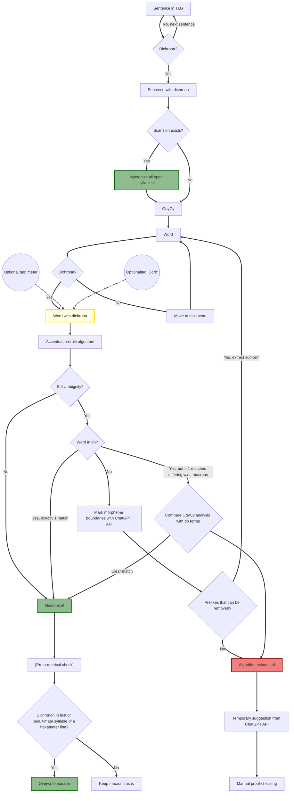

## Method
_Notes and definitions_:
- A dichronon (pl. dichrona) is an α, ι or υ (alpha, iota or ypsilon) **without circumflex** and **outside of diphthongs**. Alpha with iota subscriptum (ᾳ) is a s.c. long diphthong, and hence not a dichronon.
- The theoretical goal "in the limit" is that all **open syllables** be macronized: in practice, we can only say with full certainty that all dichrona appearing at least once in open syllables **in metrical poetry** can be macronized. For those dichrona that do not, we either rely on Ancient grammarians and the induction of modern historical linguists or pure speculation. I will refer to dichronic vowel lengths for which there is no evidence as **unknown**.
- By *true dichronon*, I mean a dichronon not disambiguated by any of the following four **accentuation rules** for Attic Greek:
   - the σωτῆρᾰ rule for penultimae, 
   - the two σωτῆρᾰ rules for ultimae and 
   - the proparoxytone rule for ultimae.
- I will use 'macron/macra/macrons' as shorthand for 'macron/macra/macrons and breve/brevia'.
- By *macronizing* is meant **disambiguating the true dichrona** of a string, or, if that is not possible, marking them as 'unknown'. This can be done by adding macra and brevia as unicode diacritics, or through, for example, wrapping each dichronon in a vowel-length XML-tag. Unknown dichrona are to be wrapped in relevant XML-tags, or the like.
- In general, **unicode diacritics for macra are to be avoided** except in cold storage, since machine updating them is terrible.
- In prose,
   - a **word** is considered *macronized*, when every open syllable in it has been macronized (or, if there is an impasse, explicitly marked as problematic).
   - a **sentence** (or passage in general) is considered macronized, when every word in it has been macronized.
- In verse,
   - a word is considered macronized, when every **non-final** open syllable in it has been macronized ([syllaba] *brevis in* [positio] *longo*).
   - a **line** is considered macronized, when every word in it has been macronized.
   - the level of the **line** introduces metrical constraints on dichrona, while the metre itself is recursively constrained by the dichrona.
      - Example of metrical constraints on vowel length: an open-syllable dichronon in the princeps of the first hexameter foot will always be long.
- Convention: the vowel lengths of **true dichrona in non-final open syllables** are never considered implied; all other vowel lengths are considered implied.
- And, finally, the TLG is considered macronized when every sentence and line in it has been macronized.

- **NB1:** The "paroxytone + short ultima" rule for the penultima *depends on endings having been macronized* since a huge amount of words end on dichrona. Likewise, the "paroxytone + long penultima" for the ultima *depends on penultima having been macronized*, to the extent penultima are dichronic.

## Work flow for the TLG macronizer:
_Specifics of the flow chart_
- Macronizing does not overwrite earlier macrons, i.e. the results of "upstream" macronizing, unless otherwise stated (which does occur).

<!-- ### Methodological problem										

Wiktionary works under the following conventions:

>Some dictionaries and lexicons operate under the standard that an unmarked vowel is short, while a long vowel will have a macron. In Wiktionary, an unmarked vowel is considered ambiguous; short vowels should be marked with breves. For instance, the second iota of πολῑτικός (polītikós) is considered ambiguous; this word should be spelled πολῑτῐκός (polītikós), with a breve on the second iota to indicate that it is short. 

Cf. https://en.wiktionary.org/wiki/Wiktionary:About_Ancient_Greek (accessed 4 dec. 2024)

- Specific problem 1: Marking of superheavies is in general irreducibly conjectural: Wiktionary's decisions are often scientifically unfounded. -->
